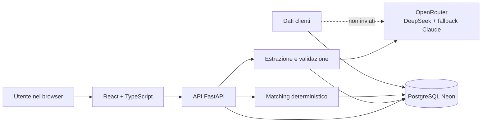
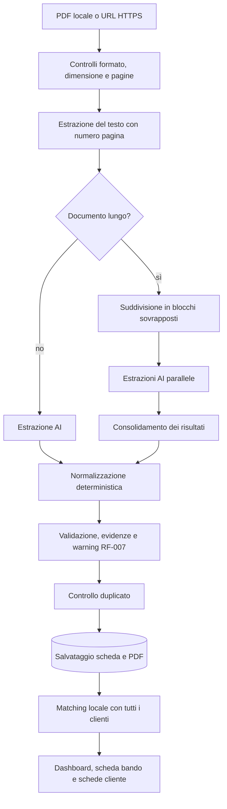

# Audit di BandoMatch AI per la presentazione

**Data dell'audit:** 14 luglio 2026
**Versione verificata:** commit `7ee92c4`, ramo `main`
**Scopo:** produrre una base tecnica, funzionale e narrativa affidabile per la presentazione e la demo del progetto.

## 1. Valutazione sintetica

BandoMatch AI è un prototipo end-to-end già consistente, non una semplice demo di una chiamata a un modello AI. Riceve un bando in PDF o da URL, ne estrae una scheda strutturata, valida e normalizza i dati, conserva il documento e confronta localmente i criteri del bando con i profili dei clienti. Il risultato viene presentato attraverso una dashboard, un archivio bandi e schede cliente con motivazioni di esclusione.

Il posizionamento corretto è quello di **strumento di pre-screening e supporto alla decisione per studi professionali**, non di sistema che certifica in modo definitivo l'ammissibilità legale. L'AI interpreta il documento; regole deterministiche controllano, normalizzano e confrontano i dati; la persona mantiene la responsabilità della verifica sulla fonte ufficiale.

Il progetto è tecnicamente pronto per essere presentato, ma prima della demo conviene correggere due dati dell'interfaccia e una dichiarazione della presentazione:

1. il KPI «Abbinamenti trovati» mostra attualmente tutte le coppie bando-cliente memorizzate, non soltanto gli abbinamenti ammissibili;
2. nel database è ancora presente un duplicato storico dello stesso bando con ente diverso, che l'attuale deduplicazione rigorosa non riconosce;
3. non va dichiarato che il matching valuta automaticamente requisiti societari complessi, come la composizione della compagine: il modello dati cliente non li contiene ancora.

## 2. Problema affrontato e valore del prodotto

I bandi sono documenti lunghi, eterogenei e scritti con terminologie diverse. Uno studio professionale deve:

- individuare scadenze, territori, destinatari, importi e vincoli;
- distinguere investimenti, contributi e finanziamenti;
- ripetere il controllo per ogni cliente;
- giustificare rapidamente perché un cliente è o non è compatibile;
- tornare comunque al documento ufficiale per la decisione finale.

BandoMatch AI riduce questo lavoro manuale trasformando il PDF in dati interrogabili e riusabili. Il beneficio dimostrabile non è «eliminare il commercialista», ma **ridurre il tempo necessario per individuare le opportunità da approfondire e rendere più tracciabile il primo controllo**.

### Utente principale

- commercialisti;
- consulenti d'impresa e finanza agevolata;
- piccoli studi che gestiscono più clienti e bandi contemporaneamente.

### Tipi di bando più adatti

Il sistema è pensato soprattutto per agevolazioni rivolte alle imprese, nelle quali i criteri sono espressi tramite dati come:

- territorio;
- codice o sezione ATECO;
- dimensione dell'impresa;
- fatturato e numero di dipendenti;
- anzianità e forma giuridica;
- investimento minimo e massimo;
- tipo, importo e percentuale dell'agevolazione;
- attività e spese ammissibili o vietate.

Non è invece progettato, allo stato attuale, per gare d'appalto, borse di studio, concorsi rivolti a persone fisiche o documenti composti soltanto da scansioni senza testo OCR.

## 3. Architettura attuale



### Componenti principali

| Livello | Tecnologia | Responsabilità |
|---|---|---|
| Frontend | React 19, TypeScript, Vite, React Router, React Query | Dashboard, archivio bandi, clienti, caricamento e schede |
| Backend | FastAPI, Uvicorn, Pydantic | API, sicurezza input, orchestrazione, download e CRUD |
| PDF | PyMuPDF | Lettura del testo e separazione delle pagine |
| AI | OpenRouter | Estrazione semantica e consolidamento dei documenti lunghi |
| Regole | Moduli Python | Normalizzazione, evidenze, validazione e matching |
| Dati | PostgreSQL su Neon, psycopg2 | Bandi, PDF, clienti e risultati di matching |
| Deploy | Docker multi-stage, Render | Build frontend e servizio web unico |

L'API espone attualmente 20 rotte applicative. Il backend contiene i flussi di caricamento PDF/URL, consultazione, download, deduplicazione, ricalcolo, gestione clienti e matching.

## 4. Flusso completo di elaborazione



### Gestione dei documenti lunghi

Il precedente limite rigido di caratteri non è più il comportamento principale. Il testo viene suddiviso in blocchi di circa 60.000 caratteri, con sovrapposizione di circa 2.000 caratteri. Tutti i blocchi vengono analizzati e i JSON parziali vengono consolidati. Esiste anche un merge deterministico di emergenza.

Questa soluzione evita di perdere automaticamente la parte finale di un bando lungo. Non garantisce però che ogni informazione venga interpretata senza errori: rimangono possibili omissioni o ambiguità del modello, motivo per cui esistono validazione, fonti, warning e revisione umana.

### Limiti di ingresso

- dimensione massima PDF: 10 MB;
- massimo 300 pagine;
- verifica della firma PDF;
- URL accettati soltanto via HTTPS e verso host pubblici;
- nessun OCR integrato per PDF costituiti esclusivamente da immagini.

## 5. Che cosa fa l'AI e che cosa resta deterministico

Questa distinzione è uno dei punti più forti da spiegare durante l'esame.

| Attività | AI esterna | Regole locali |
|---|:---:|:---:|
| Comprendere formulazioni diverse del bando | Sì | No |
| Estrarre la prima struttura JSON | Sì | No |
| Consolidare più parti di un PDF lungo | Sì | Fallback disponibile |
| Correggere tipi, enum e formati | No | Sì |
| Convertire anni, semestri e trimestri in mesi | No | Sì |
| Distinguere finanziamento da fondo perduto | Supporto | Sì |
| Verificare coerenza e campi critici | No | Sì |
| Confrontare il bando con i clienti | No | Sì |
| Decidere in via definitiva l'ammissibilità legale | No | No: serve verifica professionale |

Il provider AI riceve il testo del bando, che è un documento pubblico. I dati dei clienti non vengono inviati al modello: sono salvati nel sistema e usati dal matching locale.

## 6. Modello dati estratto

La scheda bando comprende 29 campi principali, tra cui:

- titolo, ente e altri soggetti coinvolti;
- pubblicazione, scadenza e modalità di presentazione;
- territori, ATECO, attività ammesse e dimensioni d'impresa;
- fatturato, dipendenti, anzianità e forme giuridiche;
- investimento minimo e massimo;
- tipo di agevolazione, contributo massimo e percentuale a fondo perduto;
- una lista strutturata di agevolazioni con importi, tasso, durata e condizioni;
- spese ammissibili, esclusioni, fonti ed evidenze;
- link ufficiale e URL del documento di origine;
- copertura dell'estrazione.

La struttura distingue correttamente concetti diversi:

- `contributo_max` è adatto a un contributo non rimborsabile;
- per un finanziamento agevolato l'importo massimo appartiene all'elemento strutturato `agevolazioni[].importo_max`;
- `spesa_massima_ammissibile` indica invece la dimensione massima del piano di investimento.

Nel caso Liguria, per esempio, €800.000 è il massimo investimento, mentre €400.000 è il massimo finanziamento: mostrarli come lo stesso «contributo massimo» sarebbe semanticamente errato.

La normalizzazione temporale converte in modo deterministico:

- trimestre = 3 mesi;
- semestre = 6 mesi;
- anno = 12 mesi.

## 7. Validazione, evidenze e revisione manuale

Dopo la risposta del modello, il progetto non salva il JSON alla cieca. Esegue:

- controllo della struttura e dei tipi;
- normalizzazione di date, importi, percentuali ed enum;
- deduplicazione semantica delle liste;
- riconciliazione fra testo originale e valori economici;
- controllo delle fonti associate ai campi;
- ricerca delle esclusioni ATECO soltanto quando esplicite;
- verifica di coerenza fra tipo di agevolazione e campi compilati.

Il warning **RF-007 — Da revisionare manualmente** viene prodotto quando oltre il 50% dei campi risulta nullo. Esistono inoltre avvisi per campi critici mancanti, incoerenze o copertura insufficiente.

La percentuale di completezza non va presentata come percentuale di correttezza. È un indicatore di compilazione e deve considerare quali campi siano applicabili al tipo di agevolazione.

## 8. Matching e ammissibilità

### Score di compatibilità

Lo score serve a ordinare le opportunità e non rappresenta una certificazione di ammissibilità.

| Criterio | Peso massimo |
|---|---:|
| Regione | 30 punti |
| ATECO/attività | 40 punti |
| Dimensione impresa | 20 punti |
| Fatturato | 10 punti |
| **Totale** | **100 punti** |

Per l'ATECO, una corrispondenza esatta vale più di una corrispondenza nella stessa divisione; in assenza di codici, il sistema può usare la somiglianza testuale delle attività.

### Controlli rigidi separati

L'ammissibilità viene calcolata separatamente dallo score. Il sistema controlla, quando disponibili:

- anzianità minima e massima;
- sezione ATECO esclusa;
- forma giuridica;
- dimensione d'impresa;
- fatturato massimo;
- dipendenti minimi e massimi;
- regione;
- investimento minimo, segnalato come requisito da verificare sul progetto.

L'interfaccia distingue tre esiti:

- **ammissibile rispetto ai dati disponibili**;
- **non ammissibile**, con motivazioni puntuali;
- **da verificare**, quando mancano dati o il controllo non può essere completato.

### Limite funzionale da dichiarare

Il profilo cliente non contiene ancora tutte le informazioni richieste dai bandi reali. Il sistema non può quindi verificare automaticamente, per esempio:

- composizione femminile o giovanile della società;
- presenza di business angel o investitori nella compagine;
- regolarità DURC, fiscale o stato di difficoltà;
- aiuti `de minimis` già ricevuti;
- caratteristiche dettagliate del progetto e delle singole spese;
- dichiarazioni, autorizzazioni e requisiti documentali.

La formulazione corretta in presentazione è: «il sistema effettua un pre-screening sui criteri strutturati disponibili e rende espliciti i controlli che richiedono una verifica professionale».

## 9. Interfaccia e funzioni visibili

### Dashboard

- riepilogo dei bandi e dei clienti;
- bandi con almeno un cliente ammissibile;
- sezioni separate per bandi senza clienti ammissibili e per quelli tutti da verificare;
- sezione bandi scaduti;
- punteggio, scadenza, urgenza e azioni su ogni scheda;
- accesso al PDF, alla scheda Markdown e alla fonte.

### Archivio bandi

- ricerca, filtri e ordinamento;
- tabella con titolo su massimo due righe;
- download del PDF originale e della scheda;
- cancellazione del bando;
- controllo duplicati tramite hash e confronto dei dati identificativi.

### Clienti

- elenco dei profili con conteggio reale dei bandi ammissibili;
- dettaglio cliente con score e breakdown;
- motivazioni dei casi non ammissibili;
- creazione, modifica ed eliminazione;
- matching ricalcolato dopo le modifiche.

### Carica bando

- caricamento PDF o acquisizione da URL HTTPS;
- progressione delle fasi di estrazione;
- anteprima strutturata;
- avvisi su incompletezza e possibili imprecisioni;
- avviso privacy che chiarisce l'invio del solo bando al modello esterno e il matching locale dei clienti.

## 10. Privacy, sicurezza e affidabilità

### Flusso dei dati effettivo

- il testo del bando viene inviato al provider AI esterno;
- il PDF originale viene salvato in PostgreSQL per consentire il download successivo;
- i file temporanei creati durante l'upload vengono eliminati al termine;
- i dati cliente restano nel database del progetto e non vengono inviati al provider AI;
- il matching avviene nel backend con regole locali.

È importante mantenere questa formulazione anche nell'interfaccia: non va dichiarato che il PDF non viene conservato, perché la funzione di download richiede proprio la persistenza del documento.

### Misure già presenti

- limite di richieste per IP;
- limiti su dimensione e numero di pagine;
- controllo del formato PDF;
- URL solo HTTPS, con blocco degli indirizzi privati e limite ai redirect;
- sanificazione dei delimitatori e istruzioni contro la prompt injection;
- chiavi e segreti configurati tramite variabili d'ambiente;
- query SQL parametrizzate.

### Limiti di sicurezza da non nascondere

- la chiave API condivisa viene inclusa nel frontend ed è una barriera contro l'uso casuale, non un'autenticazione reale;
- non esistono ancora utenti, ruoli o separazione dei dati fra studi diversi;
- la chiave può essere usata anche in query string per alcuni download;
- il rate limiting è in memoria e non è condiviso fra più istanze;
- la validazione DNS degli URL e la connessione HTTP sono due operazioni separate;
- il recupero URL dovrebbe rifiutare esplicitamente anche le risposte HTTP di errore;
- i PDF nel database relazionale sono adatti al prototipo, ma un object storage sarebbe preferibile in scala.

Per la presentazione si possono citare trasparenza, minimizzazione dei dati e supervisione umana come principi progettuali. Non si deve invece dichiarare una certificazione di conformità normativa o una classificazione AI Act senza una valutazione legale specifica. Riferimenti ufficiali: [Regolamento generale sulla protezione dei dati](https://eur-lex.europa.eu/eli/reg/2016/679/2016-05-04/eng) e [Regolamento europeo sull'intelligenza artificiale](https://eur-lex.europa.eu/eli/reg/2024/1689/oj?locale=en).

## 11. Qualità del codice e verifiche eseguite

### Backend

Comando eseguito:

```text
pytest -q --cov=modules --cov=main --cov-report=term
```

Risultato verificato il 14 luglio 2026:

- **366 test raccolti**;
- **349 superati**;
- **17 saltati**;
- copertura totale **83,32%**;
- soglia minima configurata: 60%;
- 2 warning di deprecazione relativi a `FastAPI.on_event`.

Copertura indicativa dei moduli principali:

| Modulo | Copertura |
|---|---:|
| `schema.py` | 93% |
| `evidence.py` | 94% |
| `url_extractor.py` | 91% |
| `extractor.py` | 85% |
| `matcher.py` | 81% |
| `validator.py` | 81% |
| `main.py` | 76% |
| `database.py` | 74% |

### Frontend

```text
npm run build
```

Build TypeScript/Vite completata senza errori. Bundle principale: circa 354 kB, 102 kB compresso gzip.

```text
npm run lint
```

Lint completato con exit code 0 e 14 warning non bloccanti, soprattutto relativi alle dipendenze degli hook e alla regola Fast Refresh.

### Limite delle prove automatiche

La suite testa bene regole, API, sicurezza, normalizzazioni e casi di errore. Non misura però in modo statistico la precisione reale del modello su un campione ampio di bandi. I test golden con chiamate AI reali sono disattivati per impostazione predefinita e restano due casi noti non risolti. Inoltre non esiste ancora una suite frontend unit/E2E.

La dichiarazione corretta è quindi: «il software ha una suite backend ampia e una copertura dell'83%; l'accuratezza semantica dell'AI è verificata con casi golden ma non è ancora una metrica certificata su larga scala».

## 12. Stato reale dei dati usati nella demo

Snapshot in sola lettura del database Neon del 14 luglio 2026:

| Dato | Valore |
|---|---:|
| Bandi | 14 |
| Clienti | 5 |
| Risultati di matching | 70 |
| Bandi con PDF salvato | 11 |
| Bandi storici senza hash | 3 |
| Gruppi duplicati per titolo | 1 |
| Bandi con almeno un cliente ammissibile verificato | 8 |
| Bandi con tutti i clienti non ammissibili | 5 |
| Bandi con tutti i clienti da verificare | 1 |
| Bandi scaduti | 2 |

Le 70 righe di matching costituiscono l'intera matrice 14 bandi × 5 clienti. Non sono 70 opportunità ammissibili. Di conseguenza il KPI «Abbinamenti trovati» è attualmente fuorviante e deve contare soltanto gli esiti realmente ammissibili, oppure essere rinominato «Confronti calcolati».

Il duplicato storico ha lo stesso titolo ma un ente diverso: una vecchia estrazione riporta FI.L.S.E., quella più recente Regione Liguria. Il controllo rigoroso titolo + ente non le considera uguali. Per la demo conviene conservare la scheda più recente e rimuovere la precedente, oppure migliorare il criterio di deduplicazione dei record storici.

## 13. Punti di forza dimostrabili

1. **Flusso completo:** non si limita all'estrazione, ma collega acquisizione, validazione, archivio, clienti e matching.
2. **Architettura ibrida:** usa l'AI dove serve interpretazione linguistica e regole deterministiche dove servono ripetibilità e controllo.
3. **Documenti lunghi:** chunking e consolidamento sostituiscono il precedente troncamento rigido.
4. **Tracciabilità:** pagine, fonti, warning, scheda e PDF restano consultabili.
5. **Spiegabilità:** score scomposto e motivazioni di non ammissibilità.
6. **Privacy by design nel matching:** i dati cliente non vengono inviati al modello.
7. **Qualità misurabile:** 349 test superati, 83,32% di copertura e build frontend pulita.
8. **Casi reali complessi:** il modello dati distingue contributo, finanziamento e investimento.
9. **Deploy riproducibile:** Docker, Render e PostgreSQL gestito.

## 14. Criticità e priorità

| Priorità | Rilievo | Impatto | Azione consigliata |
|---|---|---|---|
| P0 | KPI «Abbinamenti trovati» conta tutte le coppie | Demo e valore percepito fuorvianti | Contare solo `ammissibile = true` e non `da_verificare`, o rinominare il KPI |
| P0 | Un duplicato storico resta nel database | Archivio e conteggi incoerenti | Conservare la versione recente e rafforzare la deduplica legacy |
| P0 | La vecchia presentazione attribuisce al matching controlli sulla compagine | Dichiarazione tecnicamente falsa | Eliminare la frase o presentarla come sviluppo futuro |
| P1 | «Ammissibile» copre soltanto i dati disponibili | Rischio di sovrainterpretazione | Mostrare sempre «pre-screening» e requisiti da verificare |
| P1 | Accuratezza AI non misurata su un dataset ampio | Non si può promettere precisione totale | Preparare un benchmark annotato con precision/recall per campo |
| P1 | Nessun OCR | Alcuni PDF reali non sono elaborabili | Integrare OCR con rilevazione automatica del testo insufficiente |
| P1 | Autenticazione condivisa e nessuna multi-tenancy | Non pronto per produzione multi-studio | Login, ruoli, tenant e autorizzazioni server-side |
| P2 | Chiamata AI sincrona durante la richiesta | Timeout e scalabilità | Job asincrono con stato, retry e coda |
| P2 | PDF conservati in PostgreSQL | Crescita del database | Object storage con URL firmati e retention |
| P2 | Nessun test frontend/E2E | Regressioni UI meno protette | Vitest/Testing Library e Playwright sui flussi principali |
| P2 | Alcuni controlli tabella non sono pienamente accessibili da tastiera | Usabilità e accessibilità | Pulsanti di sort, `aria-sort` e righe focalizzabili |
| P2 | Vincoli DB non sufficienti contro le race condition | Duplicati possibili in concorrenza | Indici univoci su P.IVA e coppia cliente-bando |
| P2 | Log locali e health degradato con HTTP 200 | Osservabilità debole | Logging centralizzato, metriche e status health non-200 su errore critico |
| P3 | Documentazione storica non sempre allineata | Confusione durante la presentazione | Aggiornare README e audit vecchi usando il codice corrente come fonte |
| P3 | Funzione di troncamento rimasta nel codice ma non usata in produzione | Debito tecnico | Rimuovere o documentare come compatibilità/test |

## 15. Audit della bozza di presentazione esistente

Nel repository è presente `data/test_pdfs/ITSPresentation.pdf`, una bozza di 18 pagine. La struttura narrativa è valida: problema, soluzione, target, flusso, AI, stack, difficoltà, privacy e demo. Prima di riutilizzarla servono però queste correzioni.

### Da conservare

- l'apertura centrata sul problema dei bandi lunghi e variabili;
- il target B2B degli studi professionali;
- il flusso visuale in quattro fasi;
- la distinzione fra estrazione e matching;
- la slide conclusiva con demo;
- l'attenzione a privacy e responsabilità umana.

### Da correggere

- uniformare il nome del prodotto: il nome ufficiale è **BandoMatch AI** e il precedente nome «BandiScanner» non va più usato nelle slide;
- sostituire il placeholder «Nome Studente»;
- non dire che il troncamento è soltanto segnalato: oggi viene gestito con chunking e consolidamento;
- rimuovere la dichiarazione che i requisiti di compagine sono già valutati dal matching;
- non descrivere lo score come probabilità di ottenere il bando;
- non usare «ammissibile» come esito legale definitivo;
- indicare che il PDF viene conservato nel database;
- sostituire eventuali numeri di test precedenti con **349 superati, 17 saltati, 83,32% di copertura**;
- usare schermate e conteggi dopo la pulizia del duplicato e la correzione del KPI.

## 16. Frasi sicure da usare durante l'esame

| Si può dire | È meglio evitare |
|---|---|
| «L'AI trasforma il linguaggio eterogeneo dei bandi in una struttura comune.» | «L'AI capisce sempre tutti i dati.» |
| «Il matching dei clienti è locale e deterministico.» | «L'AI decide quali clienti possono ottenere il bando.» |
| «Il sistema effettua un pre-screening sui dati disponibili.» | «Il sistema certifica l'ammissibilità.» |
| «I PDF lunghi vengono analizzati a blocchi e poi consolidati.» | «Non esistono più omissioni.» |
| «I dati cliente non sono inviati al provider AI.» | «Nessun dato viene conservato.» |
| «La suite backend ha 349 test verdi e copertura 83,32%.» | «L'estrazione AI ha accuratezza 100%.» |
| «Le fonti e il documento originale restano disponibili per la verifica.» | «La verifica umana non è più necessaria.» |

## 17. Struttura consigliata della presentazione

### Slide 1 — Titolo

**BandoMatch AI — dall'analisi del PDF al pre-screening dei clienti**
Sottotitolo: «AI per comprendere i bandi, regole locali per confrontarli».

### Slide 2 — Il problema

- documenti lunghi e non uniformi;
- criteri dispersi fra allegati e sezioni;
- confronto ripetitivo per ogni cliente;
- rischio di perdere opportunità o interpretare male un requisito.

### Slide 3 — Utenti e valore

Target: commercialisti e consulenti.
Valore: meno tempo nel primo screening, archivio unico, controlli spiegabili e accesso rapido alla fonte.

### Slide 4 — La soluzione

Mostrare quattro blocchi: carica → estrai → valida → abbina.

### Slide 5 — Architettura

React, FastAPI, PyMuPDF, OpenRouter, motore deterministico e Neon. Evidenziare graficamente che i dati clienti non arrivano al provider AI.

### Slide 6 — Come gestisce un PDF complesso

Controlli input, testo con pagine, chunking, estrazioni parallele, consolidamento, normalizzazione e RF-007.

### Slide 7 — Dall'AI a dati affidabili

Confronto «AI» contro «regole»: comprensione linguistica da una parte; tipi, unità, coerenza, evidenze e deduplica dall'altra.

### Slide 8 — Matching spiegabile

Mostrare i pesi 30/40/20/10 e la separazione fra score e controlli rigidi. Specificare i tre esiti: ammissibile sui dati disponibili, non ammissibile, da verificare.

### Slide 9 — Interfaccia

Tre schermate: dashboard, scheda sintetica e dettaglio cliente con motivo di esclusione.

### Slide 10 — Privacy e sicurezza

Testo pubblico del bando al modello; dati cliente e matching nel sistema; PDF conservato per la verifica; limiti, validazioni e supervisione umana.

### Slide 11 —


### Slide 12 — Limiti e roadmap

OCR, benchmark AI, profilo cliente più ricco, autenticazione multi-studio, elaborazione asincrona e object storage.

### Slide 13 — Demo e conclusione

Un PDF reale → scheda sintetica → cliente ammissibile/non ammissibile → motivazione → apertura del PDF originale.

## 18. Copione consigliato per la demo

Durata ideale: 4–6 minuti.

1. Aprire la dashboard già popolata e spiegare le tre sezioni operative.
2. Mostrare un bando complesso già estratto, evitando di dipendere dalla latenza del provider durante l'esame.
3. Aprire la scheda e indicare ente, territorio, investimenti, agevolazione, spese ed esclusioni.
4. Scaricare o aprire il PDF originale per dimostrare la verificabilità.
5. Aprire un cliente ammissibile e mostrare il breakdown dello score.
6. Aprire un cliente non ammissibile e mostrare la motivazione concreta.
7. Spiegare un caso «da verificare» come scelta prudente, non come errore.
8. Se la rete funziona, caricare un PDF di prova breve. In caso contrario, usare il record già presente.

### Preparazione tecnica della demo

- correggere il KPI degli abbinamenti;
- eliminare il duplicato storico lasciando la versione più recente;
- verificare che il PDF scelto sia scaricabile;
- utilizzare sempre il nome BandoMatch AI;
- tenere pronta una scheda già estratta come fallback;
- non scegliere per la demo un PDF scansionato senza OCR;
- controllare variabili d'ambiente e stato del database;
- chiudere o nascondere dati e chiavi non destinati alla presentazione.

## 19. Domande probabili della commissione

### «Per quali bandi è pensato?»

Per bandi e agevolazioni destinati alle imprese, soprattutto quando l'accesso dipende da territorio, ATECO, dimensione, fatturato, forma giuridica, anzianità e caratteristiche dell'investimento. Non nasce come motore universale per gare, concorsi o persone fisiche.

### «Perché usare l'AI?»

Perché lo stesso concetto viene espresso in modi molto diversi nei documenti. Le sole espressioni regolari sarebbero fragili. L'AI interpreta il testo, mentre regole deterministiche controllano il risultato.

### «Come eviti le allucinazioni?»

Non è possibile eliminarle completamente. Il sistema riduce il rischio con schema rigido, normalizzazione, confronto con il testo, evidenze per pagina, validazione, warning, PDF originale e revisione umana.

### «Lo score significa che il cliente otterrà il finanziamento?»

No. Lo score ordina la compatibilità del profilo con quattro criteri. L'ammissibilità è controllata separatamente e resta un pre-screening sui dati disponibili.

### «Perché DeepSeek e Claude?»

È presente un modello primario e un fallback per aumentare la resilienza. L'integrazione tramite OpenRouter permette di cambiare modello senza riscrivere il flusso applicativo.

### «Che cosa succede con un PDF molto lungo?»

Il testo viene suddiviso in blocchi sovrapposti, analizzato per intero e consolidato. Non viene semplicemente tagliato a una soglia fissa.

### «Dove vanno i dati?»

Il testo pubblico del bando viene inviato al provider AI. PDF, schede e clienti sono conservati nel database del progetto; i dati cliente non vengono inviati al provider e il matching è locale.

### «È già pronto per essere venduto?»

È un prototipo avanzato e dimostrabile. Per un prodotto multi-cliente servono autenticazione reale, separazione per studio, benchmark dell'estrazione, OCR, elaborazione asincrona e infrastruttura di storage/monitoraggio più robusta.

## 20. Conclusione dell'audit

Il progetto ha una tesi tecnica chiara: **usare l'AI per trasformare documenti eterogenei e regole deterministiche per rendere il risultato controllabile e confrontabile**. Questa tesi è più forte e credibile di una promessa di automazione totale.

La presentazione dovrebbe dimostrare tre cose:

1. BandoMatch AI risolve un problema reale per un utente preciso;
2. l'architettura separa correttamente interpretazione AI, validazione e matching;
3. il sistema conosce i propri limiti e mantiene fonte ufficiale e supervisione umana al centro.

Con la correzione del KPI, la pulizia del duplicato e l'aggiornamento delle affermazioni della bozza, il progetto dispone di materiale sufficiente per una presentazione tecnica solida e una demo coerente.

## 21. Evidenze principali nel repository

- `README.md`: installazione, stack e flusso generale;
- `main.py`: API e orchestrazione;
- `modules/extractor.py`: PDF, chunking e chiamate AI;
- `modules/schema.py`: struttura dei dati e normalizzazioni;
- `modules/evidence.py`: riconciliazione e fonti;
- `modules/validator.py`: controlli e warning;
- `modules/matcher.py`: score e ammissibilità;
- `modules/database.py`: persistenza PostgreSQL;
- `frontend/src/`: pagine e componenti dell'interfaccia;
- `tests/`: suite backend e casi di sicurezza;
- `Dockerfile` e `render.yaml`: build e deploy;
- `data/test_pdfs/ITSPresentation.pdf`: bozza di presentazione da aggiornare.
